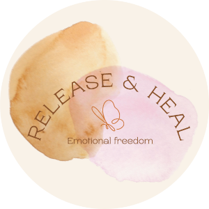
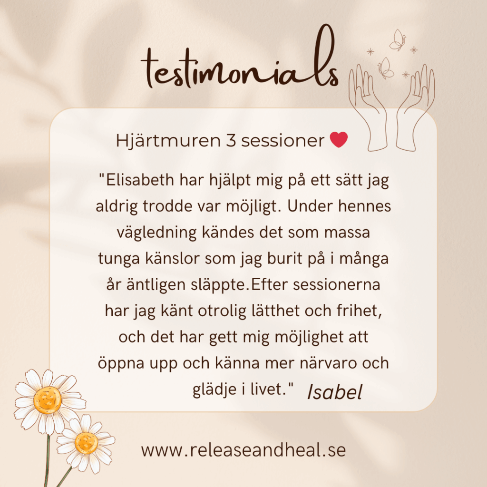
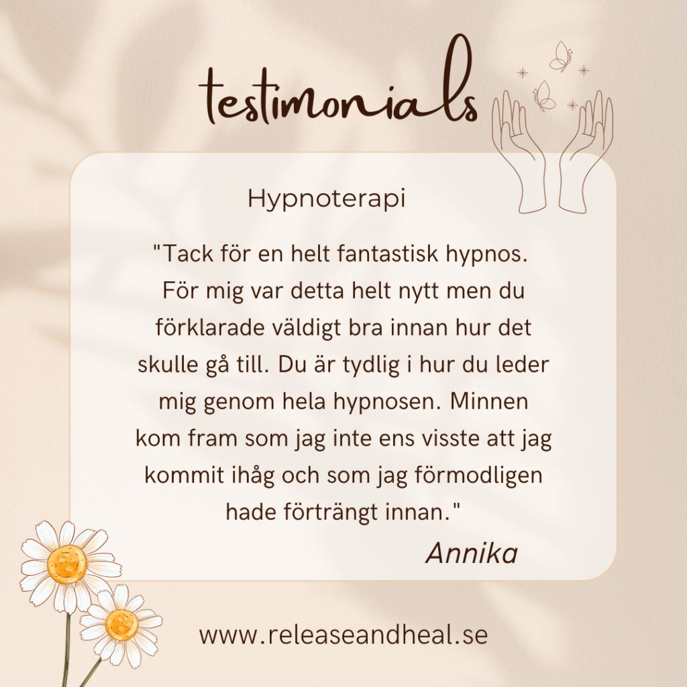
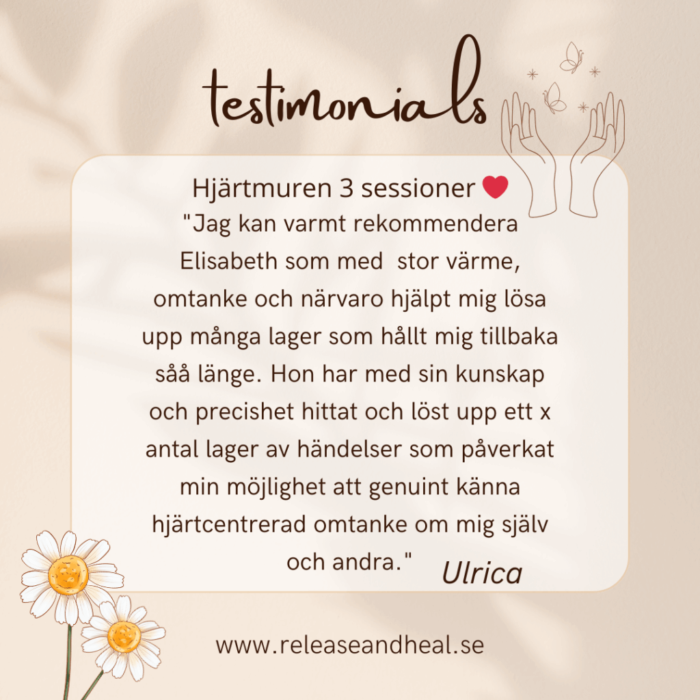
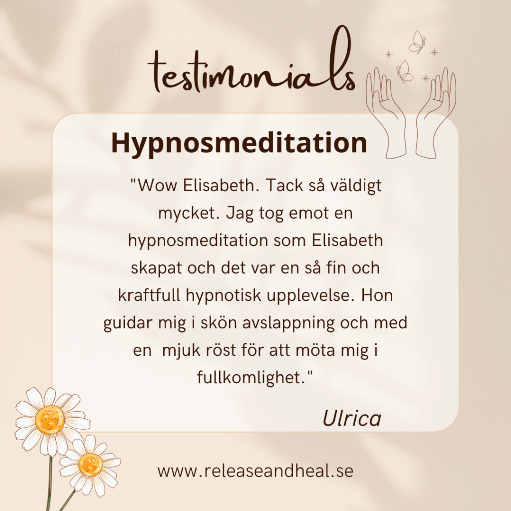
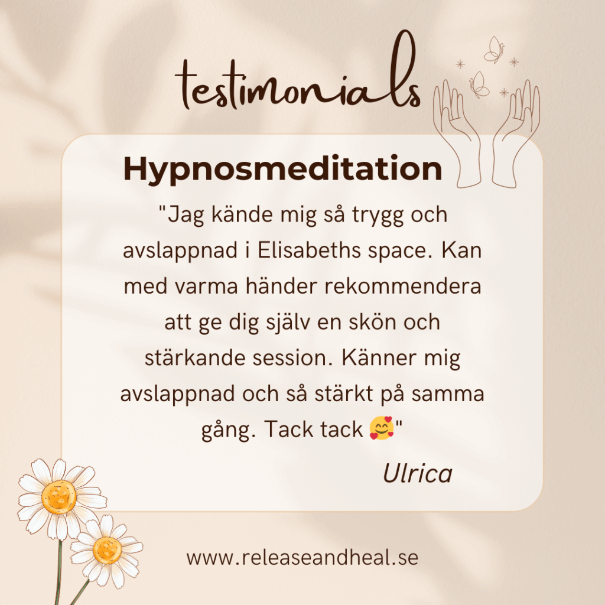
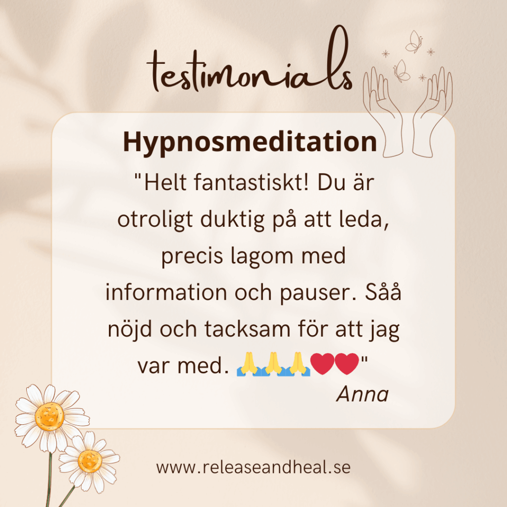

  
  
  

## Välkommen till Release & Heal

Så fint att du hittat hit! Jag som driver Release & Heal heter Elisabeth Rietz och jag är coach, terapeut, healer & medium. Här erbjuds du:

<ul style="margin: 1em 0 2em 0; padding-left: 1.2em; color: #7c5c3e; font-size: 1.1em; line-height: 2.2em;">
  <li>Hypnoterapi</li>
  <li>NLP-coaching</li>
  <li>Medial vägledning</li>
  <li>Healing med Reiki & Emotion code</li>
  <li>Livscoaching</li>
  <li>Helande samtal</li>
  <li>Återhämtningsterapi</li>
  <li>Mindfulness</li>
  <li>Meditation</li>
  <li>Personlig och andlig utveckling</li>
  <li>Reikikurser (kommande)</li>
</ul>

Jag ser holistiskt på människan och hälsan. Allt hänger samman – det mentala, fysiska, emotionella och andliga. Du får stöd och vägledning med metoder som hjälper dig med stress, utmattning, självkänsla, medberoende och ohjälpsamma mönster. Vill du kan du även få medial vägledning för att hitta din livsväg och lära känna dig själv på djupet.

Jag skräddarsyr hjälpen efter dina behov och arbetar främst online, men kan även erbjuda sessioner i Veberöd.

Min drivkraft är att vara en katalysator för transformation – att hjälpa dig finna kärleken till dig själv och växa som människa.

**Varmt välkommen!**

## Boka tid / Kontakt

Fyll i formuläret nedan för att boka tid eller kontakta mig.

<form action="https://formspree.io/f/YOUR_FORM_ID" method="POST" style="max-width:400px;margin:0 auto 2em auto;display:flex;flex-direction:column;gap:16px;">
  <input type="text" name="Namn" placeholder="Namn" required style="padding:12px;border-radius:6px;border:1px solid #f6d2a5;">
  <input type="email" name="E-post" placeholder="E-post" required style="padding:12px;border-radius:6px;border:1px solid #f6d2a5;">
  <textarea name="Meddelande" placeholder="Meddelande" required style="padding:12px;border-radius:6px;border:1px solid #f6d2a5;min-height:100px;"></textarea>
  <button type="submit" class="cta" style="width:100%;font-size:1.1em;">Skicka bokningsförfrågan</button>
</form>
## Omdömen

  

    
    
    
    
    
    
    
    
  

  <button class="carousel-btn prev">&#10094;</button>
  <button class="carousel-btn next">&#10095;</button>

---

> "Släpp taget om det gamla och ge plats för det nya. Release & Heal hjälper dig på din resa!"

